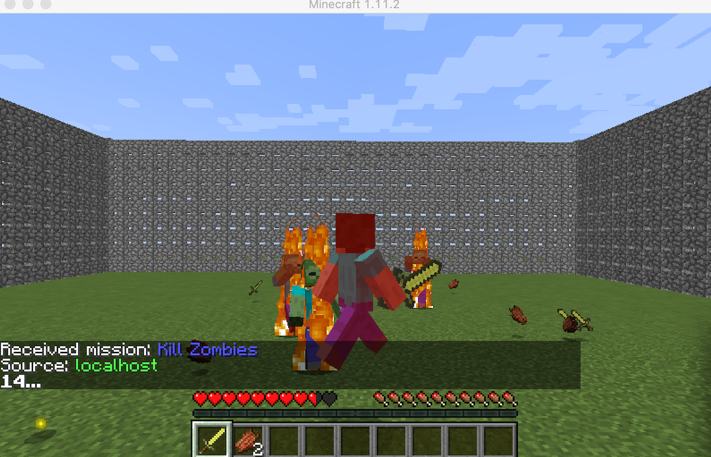
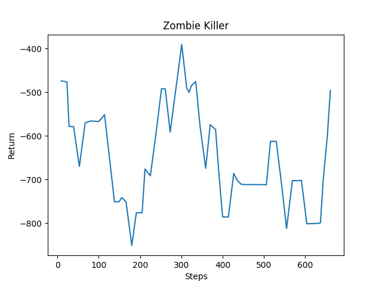

## Project Summary ##

  Our hero Sam will fight with zombies in a 16x16 arena. The difference between our Sam and Sam who in the video game is that our Sam is using golden sword to fight. Sam is able to  move and turn around to deal damage and try to kill all the zombies from all directions. Under 20 seconds limit, Sam will try to kill all the enemies while avoiding as less damage as possible.

Current situation video: 
<iframe width="560" height="315" src="https://www.youtube.com/embed/bhiMuO7yud4" frameborder="0" allow="accelerometer; autoplay; clipboard-write; encrypted-media; gyroscope; picture-in-picture" allowfullscreen></iframe>

## Approach ##

### Deep Q Learning ###

- Serious Sam, based on a game, will utilize deep reinforcement learning, specifically the Q-learning algorithm to make itself smarter. Though Q-learning on it's own is a powerful algorithm, Serious Sam has a lot of different state-action pairs which make it easier to incorporate deep learning. Sam, our agent, starts off with a Q-network and a Target Network that each has one hidden layer and uses linear regression algorithm to calculate the Q-values. Sam will continue to update the Q-network until it either dies or the episode has maxed on the number of steps it can take.

-

- Originally, Sam starts taking epsilon-greedy actions to ensure that Sam explores properly. As our epsilon value decreases, Sam starts to take actions that have a higher Q-value, that allows it to exploit higher reward actions more. Epsilon starts with a value of 1 and decreases by 0.999 each episode run.

- Currently, Sam can take four actions: move forward, turn left, turn right, or attack.

- To enforce that Sam tries harder to stay alive, the reward for dying is -1000. If Sam was able to attack a Zombie, it will receive +100. Lastly, if Sam was just running away and not killing the Zombies, causing the timer to run out, we gave it -10 points. We are still experimenting with the reward function, because Sam dies often, causing it too see positive reward less. For example, we are trying to add negative reward for every action taken, so Sam will learn to strategize and kill the Zombies faster.

## Evaluation ##

Qualitative:
- Once we see our Serious Sam fighting off Zombies by timing his sword strikes and walking towards the Zombies

Quantitative:
- In terms of Quantitative results, we would like to see the graph of results on an upward trend as the steps go up. Currently, the results are not positive in correlation with the number of steps.

## Remaining Goals and Challenges ##

  For the update version in the future, we expect our hero Sam will be able to move and turn around faster for dodging the attacks from the enemies. Moreover, Sam's attacking timing is also need to be improved; so, Sam can deal more damage to kill enemies. the enemies will spawn randomly in the map. For answering this, we need to improve our Q table, angle and choosing target functions to make the situation better. For instance, which direction should the agent turn, which way has less enemies, avoiding to get knock back into walls or corners and attack faster and more accuracy.
If we can do all of these above, maybe we can try different enemies like witches who can fly in the air; so, Sam should switch weapon like bow to shoot witches.

## Resources Used ##

build_test.py, mob_fun.py, tabular_q_learning.py and moving_target_test.py from Canvas page.  
https://eg.bucknell.edu/~cld028/courses/379-FA19/MalmoDocs/classmalmo_1_1_mission_spec-members.html  
https://microsoft.github.io/malmo/0.17.0/Python_Examples/Tutorial.pdf  
https://tsmatz.wordpress.com/2020/07/09/minerl-and-malmo-reinforcement-learning-in-minecraft/  
https://github.com/microsoft/malmo/blob/master/Schemas/Types.xsd  
https://microsoft.github.io/malmo/0.14.0/Schemas/Mission.html#element_Weather  
https://towardsdatascience.com/simple-reinforcement-learning-q-learning-fcddc4b6fe56
